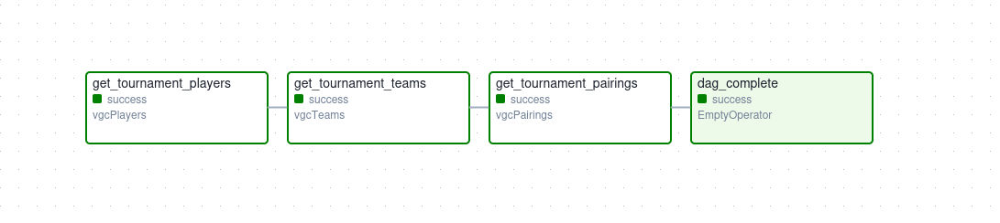
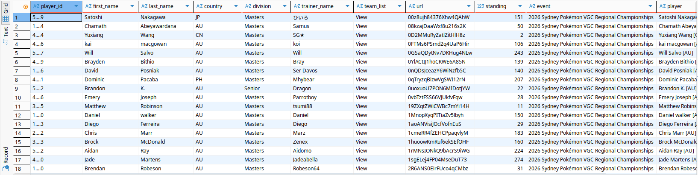
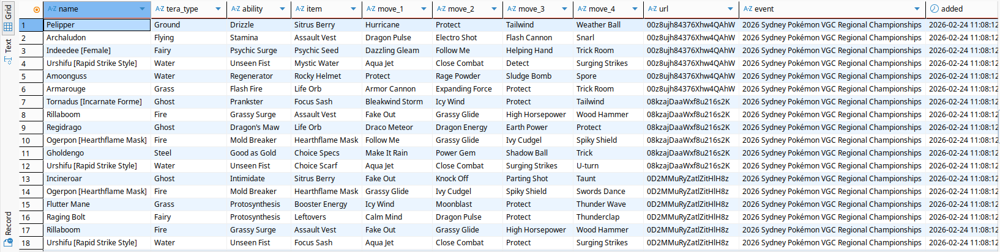
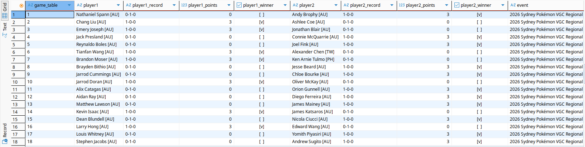

## **Practical Application of Airflow**

### Problem 📒

In this task, we'll be applying what we have learned in the **Airflow** automisation module by creating an automisation pipeline for a live VGC event

- Our task will be to integrate existing codes into a process in which scripts are run manually every so often during a live event, to fill up the database of event data extracted from **`rk9.gg`**.
- Usually, this process is done after each event has finished, since the data parsed is usually complete by this time.
- The issue with such a manual approach is that it relies on us manually running scripts and only then using the data in downstream analysis.
- We have created **`superset`** dashboards in our downstream tasks which can be utilised to analyse the event data at any time, and periodically updated data will allow us to keep track of the events that happen during the tournament.


### VGC event data 🗃️

Each event on **`rk9.gg`** has a unique identifier, for example the Sydney regional is **SY02sMDp6JmCcnCynSLn**. For each identifier, we have a **player roster**, which contains
the player sign up details (player identity data & their teamsheet) and the **player pairings** for each round. The player sign up sheet is fixed before the event begins, but 
the team sheet is not public day 1 of the event, so the parsed data needs to be parsed periodically and updated once the data is available. The same applies to player pairings; which are updated after each round, so automisation
using airflow will be useful to start the scripts at specific intervals and overwrite the existing older versions of the data for this event, whenever data becomes available.

[Sample Roster](https://rk9.gg/roster/SY02sMDp6JmCcnCynSLn) | [Sample Teamlist](https://rk9.gg/teamlist/public/SY02sMDp6JmCcnCynSLn/azP9QknuV5I6UWQyNCMw) | [Sample Pairings](https://rk9.gg/pairings/SY02sMDp6JmCcnCynSLn)

### Requirements 📜

The scripts run on an existing **airflow** cluster (you can use a preset [docker configuration](https://github.com/mrugankray/Big-Data-Cluster/tree/main), which contains both **postgres**, **pgadmin** and **airflow**)    and utilise the local **PostgresHook** : `postgres_local` (which is our local postgres DB)

### Airflow Tasks Setup 📋

The taskflow is very simple in this case

**`get_player_data`** >> **`get_team_data`** >> **`get_pairings_data`** >> **`ending`**

where:

- **`get_player_data`** : The task which parses the player roster & extracts the teamsheet urls (if they exist)
- **`get_team_data`** : The task which parses each of the url links obtained from the previous task `get_player_data`
- **`get_pairings_data`** : The task which extracts the player matches for each round of the tournament



Every tournament has its own **starting time** & **ending time**, hence we set the shedule interval to `timedelta(hours=1)`, so our airflow scheduler 
activates the DAG every hour, parsing the tournament data and overwriting existing data in the database if it has been updated.

```python
DEFAULT_ARGS = {
    'owner': 'admin',
    'start_date': datetime(2026,1,1),  # starting day of the tournament
    'end_date': datetime(2026,1,4),      # final day of the tournament
    'retry_delay': timedelta(minutes=2),  # wait 2 min between retries
    'max_retry_delay': timedelta(minutes=10),  # maximum wait time
    'retry_exponential_backoff': True  # 2min → 4min → 8min
}

dag = DAG(
    "parse_players",
    default_args=DEFAULT_ARGS,
    schedule_interval=timedelta(hours=1),  # script is called updated by the scheduler
    max_active_runs=1,
    tags=['vgc','parse event']
)
```

### Files 📃

```bash
├── create_tables.py
├── dags
│   ├── get_vgc.py
│   └── readme.md
├── plugins
│   └── vgcrk9
│       ├── parse_rk9.py
│       ├── readme.md
│       └── vgcOperator.py
├── readme.md
├── tournament_pairings.png
├── tournament_players.png
└── tournament_teams.png
```

We use a single dag file stored in folder `/dags/`, the default folder where **Airflow** searched DAGS.

- **`create_tables.py`** : Create new tables in which data is stored after parsing (if they don't exist)
- **`/dags/get_vgc.py`** : The tasks for the DAG are defined here
- **`/plugins/vgcrk9/vgcOperator.py`** : Customer operators storing the logic
- **`/plugins/vgcrk9/parse_rk9.py`** : Helper functions for our custom operator


### End Result 📊

The images below show the final result of the **airflow** job, storing the relevant parsed data into the database





### Links 🔗

- A [kaggle notebook](https://www.kaggle.com/code/shtrausslearning/vgc-analysis) containing a sample data aggregation using **polars** using the existing table data can be found on kaggle
- And the dataset can be downloaded on [kaggle](https://www.kaggle.com/datasets/shtrausslearning/pokemonvgc), which is updated only periodically.


